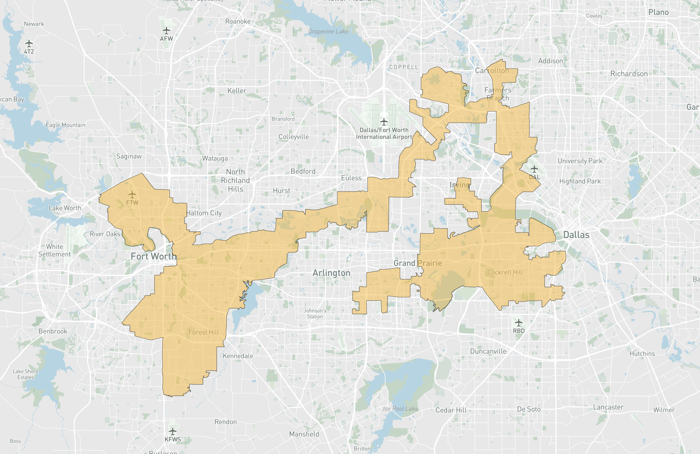

# The New Political Consequences to Removing Non-Citizens from Apportionment

_Written by Jonathan Cervas_

Several weeks ago, President Trump urged Texas Republicans to redraw their congressional district lines, potentially allowing for his party to gain as many as five additional seats. (J. David Goodman, Shane Goldmacher Reporting from Houston & Shane Goldmacher from New York, White House Pushes Texas to Redistrict, Hoping to Blunt Democratic Gains, The New York Times, June 9, 2025, https://www.nytimes.com/2025/06/09/us/politics/trump-texas-redistricting.html). This week, the Texas legislature will begin a special session that will appease the president. (Texas Republicans Aim to Redraw House Districts at Trump’s Urging, but There’s a Risk, AP News (July 20, 2025), https://apnews.com/article/trump-republicans-congress-redistricting-gerrymandering-texas-cb63c6b0102bc45a11515c6b33efc697).

Mid-decade redistricting is uncommon unless prompted by a court order. Recently, the Department of Justice sent Texas a memo outlining legal justifications for redrawing district lines, but such a letter is not required for the legislature to proceed. (Here & Now Newsroom, WBUR, July 15, 2025.) Texas is considering a new redistricting plan during a special summer session—a move reminiscent of 2003, when a mid-decade redistricting led to additional GOP seats. (Karen Brooks Harper, "Texas Democrats’ decampment over voting legislation has echoes of 2003 redistricting fight," The Texas Tribune, July 15, 2021, https://www.texastribune.org/2021/07/15/texas-democrats-walkout-voting-redistricting-2003/.)

Actions by the Trump administration reignited debates over the basis for congressional representation. (See: "Texas Republicans Look to Jam Democrats With Vote on Redistricting," The New York Times, https://www.nytimes.com/2025/07/21/us/politics/texas-redistricting-floods.html.) While much of the focus remains on Texas and partisan responses from "blue states", Republican lawmakers have also introduced legislation to add a citizenship question to the Census and require immediate nationwide redistricting. ("MTG Pushes for New Census That Only Counts US Citizens, Redrawing Districts," The Hill, July 1, 2025, https://thehill.com/video/mtg-pushes-for-new-census-that-only-counts-us-citizens-redrawing-districts-rising/10853574/.) This would represent a major shift from the longstanding practice of counting all residents—citizens and non-citizens alike—for apportionment.

The proposal revives a controversial effort from the previous Trump administration (see _DEPARTMENT OF COMMERCE v. NEW YORK_, https://www.supremecourt.gov/opinions/18pdf/18-966_bq7c.pdf), and its implications for political representation are sweeping. The Constitution requires a count of the "whole number of persons in each state" to apportion congressional seats. Yet, the administration contends that "persons" can be interpreted to mean only citizens, citing presidential discretion and historical ambiguity. Legal scholars, however, point to the plain language of the 14th Amendment, and the issue is almost certain to be litigated.

Shifting representation to a citizen-only basis would generally benefit more rural, less diverse, and often more conservative states, potentially altering the partisan balance in the House of Representatives. This change would also affect the distribution of federal resources and the allocation of presidential electors, with consequences that could last for a decade. However, the political impact is not entirely straightforward. Two key factors complicate the expected outcomes: (1) the loss of congressional seats through apportionment would disproportionately harm some states that Republicans typically win, and (2) recent trends in Latino voting suggest that a growing share of this demographic is supporting Republican candidates, meaning that reducing representation in Latino-heavy areas could ultimately backfire for the GOP. (Russell Contreras, "Trump Came Close to Winning Latino Vote in ’24 — Pew Analysis," Axios, June 26, 2025, https://www.axios.com/2025/06/26/trump-harris-latino-voters-2024-election-pew).

## Legal and Historical Context

The debate over who should be counted for apportionment is not new. In 2019, the Supreme Court struck down a similar citizenship question in _Department of Commerce v. New York_, finding the government’s justification "contrived." At the time, Census experts and civil rights organizations warned that including such a question could deter responses, leading to an undercount. Even without a citizenship question, minority communities are disproportionately likely to be left out of the count. (Hansi Lo Wang, These 14 States Had Significant Miscounts in the 2020 Census, NPR, May 19, 2022, https://www.npr.org/2022/05/19/1099810793/census-undercount-by-state-arkansas-florida-illinois-mississippi-tennessee-texas).

Advocates for excluding non-citizens—both legal and undocumented—from apportionment have included prominent figures in the Trump administration, such as Hans A. von Spakovsky. He has argued that counting non-citizens distorts congressional representation and undermines the principle of "one person, one vote," since districts with large non-citizen populations require fewer votes to elect a representative. (See: Hans A. von Spakovsky, "The Threat of Non-Citizen Voting," Heritage Foundation, July 10, 2008.)

On the other side, many scholars emphasize the 225-year tradition of counting all residents for apportionment, regardless of citizenship. Immigrants—citizens and non-citizens alike—contribute to their communities, pay taxes, own homes, and often have U.S.-born children in local schools. Excluding them would break with historical precedent and diminish the representation and resources allocated to diverse communities. (See: Tye Rush, Samuel Hall & Matt A. Barreto, "The Importance of Counting All Immigrants for Apportionment and Redistricting," 75 1667 (2024).)

The Supreme Court has yet to rule on whether a count that excludes non-citizens would be constitutional. In _Evenwel v. Abbott_ (2016), the Court upheld the use of total population for redistricting but stopped short of requiring it, leaving the door open for future challenges to a citizen-only apportionment.

## The Political and Demographic Implications

Non-citizens live in nearly every corner of the country, though their numbers are concentrated in states like California, Texas, Florida, and throughout the Northeast. To visualize these patterns, consider a cartogram that distorts geographic space to reflect data: the size of each circle represents the total non-citizen population in a county, while shading indicates the proportion of non-citizens relative to the county’s total population.

### Map of Non-Citizen Population by County

States such as California, New York, and Illinois have especially high concentrations of non-citizen residents—populations that would no longer be counted in the reapportionment base. These communities are often clustered in urban areas and are disproportionately Latino and Asian, but also include immigrants from Europe, Africa, and elsewhere. Excluding them would not only reduce their political representation but could also erode public trust in the Census and government institutions. Nearly every county has some non-citizen residents, but those with low rates of non-citizens will benefit with a change in the population base.

## The Methodology Behind the Analysis

To assess the impact of this proposed change, I analyzed data from the 2021 and 2023 American Community Survey (ACS) 1-year estimates. I estimated changes in non-citizen populations across states and projected these figures to 2030 based on recent trends. Using both total and citizen-only population projections, I applied the standard apportionment formula to simulate two scenarios:

* Scenario 1: Apportionment based on total population (current standard)
* Scenario 2: Apportionment excluding non-citizens (proposed change)

State-level estimates of population growth between 2021 and 2023 were used to project total and citizen-only populations for 2030. The method of equal proportions, the standard apportionment formula, was then applied to both sets of figures.

## Key Findings and Shifts in Representation

Compared to the official 2020 apportionment, the 2030 Census under a citizen-only count would yield:

 * California losing 4 seats (from 52 to 48)
 * Illinois and New York each losing 1 seat
 * Arizona, Michigan, Ohio, Tennessee, Idaho, and Utah each gaining 1 seat

This amounts to a six-seat shift away from states carried by Harris and toward those won by Trump. Texas and Florida—both large, immigrant-rich states carried by Trump—see no net change, as population growth offsets the loss of non-citizen residents. California’s losses are especially pronounced, reflecting both its large non-citizen population and a projected population decline of nearly 200,000.

Yet, the partisan implications are not as clear-cut as they might seem. While states Trump carried would collectively lose six districts (and electors), Harris states would lose just two. Harris states would gain three, and Trump states five. Michigan—a state Trump has both won and lost—would gain a seat, complicating the narrative that excluding non-citizens would uniformly benefit Republicans.

Rapidly growing states such as Florida and Texas would see the benefits of their population increases erased if non-citizens are excluded from the count. Although recent growth should result in five additional representatives between them, omitting non-citizens means these states would not gain any new seats. Instead, representation would be added to reliably "blue" states like Colorado, Mineesota, and Oregon.

|            | Population Change (est) | Predicted 2030 Apportionment | Predicted 2030 Apportionment (Citizens) | Difference |
|------------|-------------------------|------------------------------|-----------------------------------------|------------|
| Florida    | 2,705,724               | 31                           | 28                                      | -3         |
| California | -181,715                | 50                           | 48                                      | -2         |
| Texas      | 2,218,436               | 40                           | 38                                      | -2         |
| Georgia    | 855,624                 | 15                           | 14                                      | -1         |
| Illinois   | -23,869                 | 16                           | 16                                      | -          |
| New York   | -260,403                | 25                           | 25                                      | -          |
| Colorado   | 152,696                 | 7                            | 8                                       | +1         |
| Minnesota  | 59,451                  | 7                            | 8                                       | +1         |
| Montana    | 37,262                  | 1                            | 2                                       | +1         |
| Oregon     | 27,272                  | 5                            | 6                                       | +1         |
| Michigan   | 138,005                 | 13                           | 14                                      | +1         |
| Ohio       | 157,142                 | 15                           | 16                                      | +1         |
| Tennessee  | 465,399                 | 9                            | 10                                      | +1         |
| Utah       | 249,923                 | 4                            | 5                                       | +1         |

Yet, the partisan implications are not as clear-cut as they might seem. While states Trump carried would collectively lose six districts (and electors), Harris states would lose just two. Harris states would gain three, and Trump states five. Michigan—a state Trump has both won and lost—would gain a seat, complicating the narrative that excluding non-citizens would uniformly benefit Republicans.

Rapidly growing states such as Florida and Texas would see the benefits of their population increases erased if non-citizens are excluded from the count. Although recent growth should result in five additional representatives between them, omitting non-citizens means these states would not gain any new seats. Instead, representation would be added to reliably "blue" states like Colorado, Mineesota, and Oregon.

### The Effect of Non-Citizens on Apportionment

|            | Population (2020) | Predicted 2030  | Difference | 2020 | 2030 (est)    | Difference |
|------------|-------------------|-----------------|------------|------|---------------|------------|
| Florida    | 21,538,187        | 24,243,911      | 2,705,724  | 28   | 31            | +3         |
| California | 39,538,223        | 39,356,508      | -181,715   | 52   | 50            | -2         |
| Texas      | 29,145,505        | 31,363,941      | 2,218,436  | 38   | 40            | +2         |
| Georgia    | 10,711,908        | 11,567,532      | 855,624    | 14   | 15            | +1         |
| Illinois   | 12,812,508        | 12,788,639      | -23,869    | 17   | 16            | -1         |
| New York   | 20,201,249        | 19,940,846      | -260,403   | 26   | 25            | -1         |
| Colorado   | 5,773,714         | 5,926,410       | 152,696    | 8    | 7             | -1         |
| Minnesota  | 5,706,494         | 5,765,945       | 59,451     | 8    | 7             | -1         |
| Montana    | 1,084,225         | 1,121,487       | 37,262     | 2    | 1             | -1         |
| Oregon     | 4,237,256         | 4,264,528       | 27,272     | 6    | 5             | -1         |

Note: 2030 population is estimated by modeling the change between 2021 and 2030, and predicting growth out to 2030. 

## Spillover Effects on Redistricting

Excluding non-citizens from the Census would have consequences beyond the allocation of congressional seats. While the Supreme Court in *Evenwel v. Abbott* affirmed that states may use total population as the basis for drawing legislative districts, the availability of citizen-only data could prompt some states to adopt it for redistricting. Because non-citizens are unevenly distributed within and across states, this shift would significantly alter the internal balance of political power.

Research indicates that using a citizen-only population base for redistricting would reduce the number of minority–majority and minority-opportunity districts. (See: Christian Haas, Peter Miller & Steven O. Kimbrough, "An Algorithmic Approach to Legislative Apportionment Bases and Redistricting," 79 Electoral Studies 102520 (2022), https://www.sciencedirect.com/science/article/pii/S0261379422000774.) The full impact is difficult to quantify, given the complexity and variability of redistricting, but the general effect would be to require districts with high non-citizen populations to expand geographically to meet population equality requirements. This would dilute the representation of communities with large non-citizen populations, shifting political influence away from urban and diverse areas toward surrounding regions with more citizens.

While a comprehensive analysis of these effects is beyond the scope of this essay, it is clear that excluding non-citizens from redistricting would reshape the political landscape within states, further compounding the national shifts in representation. Districts with the most non-citizens would see the largest reduction of representation. For instance, data projections suggests that Texas District 33 based in Dallas-Fort Worth, would have the greatest shortfall all of districts in the country if non-citizens are excluded from redistricting. It would require incorportating more of the surrounding districts. This implies less representation for citizens in this area. 

[Figure about here]

The political consequences of shifting to a citizen-based population base for redistricting are clear. Of the five districts that would need to add population to satisfy the "one person, one vote" requirement, all but one are currently represented by Democrats. Conversely, all five of the districts that would be overpopulated based on citizen counts are held by Republicans. This dynamic creates a structural advantage for the GOP: underpopulated Democratic districts would be forced to absorb more voters—often from neighboring Republican-leaning areas—while overpopulated Republican districts could redistribute their voters to help flip additional seats.

The table below summarizes the most affected districts:

| District         | Representative         | Party |
|------------------|-----------------------|-------|
| Texas 33         | Marc Veasey           | D     |
| New York 6       | Grace Meng            | D     |
| Florida 27       | María Elvira Salazar  | R     |
| Texas 29         | Sylvia Garcia         | D     |
| New Jersey 8     | Rob Menendez          | D     |
|                  |                       |       |
| New York 24      | Claudia Tenney        | R     |
| New York 23      | Nick Langworthy       | R     |
| Florida 12       | Gus Bilirakis         | R     |
| Texas 12         | Craig Goldman         | R     |
| Texas 21         | Chip Roy              | R     |

This pattern underscores how a citizen-only apportionment base could systematically benefit Republicans in the redistricting process, as map-drawers would have both the incentive and the means to consolidate GOP power in affected states.

Districts that are represented by Republicans would need to reduce their citizen population by X on average. In contrast, districts represeted by Democras would have to add Y citizens, on average. Of course the exact composition of districts in this alternative universe is uncertain and is subject to the political context of the state, along with the future legality of federal laws contained in the Voting Rights Act.

# Conclusion: A Battle Over Representation

The proposed citizenship question for the 2030 Census is far more than a bureaucratic tweak. It represents a fundamental redefinition of who counts in American democracy. By changing the population base, the proposal would reduce federal funding for essential services—education, healthcare, infrastructure—in undercounted states, while also diminishing civic engagement and trust in government among immigrant communities. The consequences would be profound, altering congressional power, shifting billions in federal funding, and challenging the integrity of the Census as a nonpartisan institution.

Legal challenges are all but certain if the administration proceeds. But the political motivations and demographic consequences are already clear. The stakes for immigrant-rich states are enormous, and the battle over representation is far from over.

